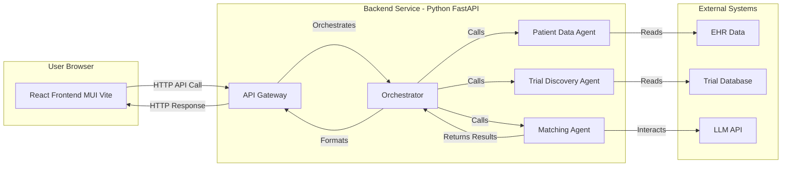

# 🚀 AI-Powered Clinical Trial Matching Agent 🩺

[](https://opensource.org/licenses/MIT)
<!-- Add other badges if relevant: build status, code coverage etc. -->

**Accelerate clinical trial recruitment by intelligently matching patients to relevant studies using agentic AI.**

This project demonstrates a modern web application leveraging AI agents (orchestrated via agno) to automatically parse patient data (mocked) and complex clinical trial protocols, presenting potential matches directly to clinicians within a user-friendly interface.

---

## ✨ Demo ✨

**(Replace this section with a high-quality screenshot or, even better, an animated GIF of the application in action!)**


*Caption: Example showing patient ID entry, loading state, and ranked trial matches with rationale.*

---

## 🌟 Key Features

*   **🤖 Agentic AI Matching:** Utilizes a backend powered by Python, FastAPI, and Agno to orchestrate agents that:
    *   Simulate fetching and processing patient profiles.
    *   Simulate querying external trial databases (like ClinicalTrials.gov).
    *   Employ LLMs (mocked/conceptualized) via Agno to analyze complex eligibility criteria against patient data.
*   **⚡ Fast & Responsive UI:** Modern frontend built with React (using Vite) and Material UI (MUI) for a professional, cutting-edge look and feel.
*   **📋 Ranked & Explained Results:** Displays potential trial matches ranked by relevance.
*   **✅ Clear Match Rationale:** Shows *why* the AI suggested a specific trial based on key criteria.
*   **⚠️ Flags Potential Issues:** Highlights uncertainties or potential exclusion criteria identified by the AI, prompting further clinician review.
*   **🔗 Direct Links:** Provides easy access to full trial details on external registries (e.g., ClinicalTrials.gov).
*   **🛠️ Mock Data Simulation:** Uses predefined mock patient and trial data for demonstration purposes, allowing exploration without real PHI or complex setup.
*   **🔄 Clear Status Indicators:** Provides user feedback during searching (loading spinners) and displays informative messages for errors or "no matches found" scenarios.

---

## 🤔 Why This Project?

Finding and enrolling suitable patients is a major bottleneck in clinical research. Manual matching is time-consuming, error-prone, and limited by clinician bandwidth and awareness. This project demonstrates how AI agents can:

*   **Save Significant Clinician Time:** Automates the laborious process of sifting through records and protocols.
*   **Improve Match Quality:** Systematically compares detailed criteria, potentially reducing screen failures.
*   **Increase Patient Access:** Identifies opportunities that might otherwise be missed.
*   **Accelerate Research:** Helps fill trials faster, bringing treatments to patients sooner.
*   **Showcase Modern AI:** Provides a practical example of agentic AI workflows in healthcare.

---

## 🛠️ Technology Stack

*   **Frontend:**
    *   [React](https://reactjs.org/) (UI Library)
    *   [Vite](https://vitejs.dev/) (Build Tool & Dev Server)
    *   [Material UI (MUI)](https://mui.com/) (React Component Library)
    *   [JavaScript (ES6+)](https://developer.mozilla.org/en-US/docs/Web/JavaScript)
    *   HTML5 / CSS3
*   **Backend:**
    *   [Python 3.9+](https://www.python.org/)
    *   [FastAPI](https://fastapi.tiangolo.com/) (High-performance API Framework)
    *   [Uvicorn](https://www.uvicorn.org/) (ASGI Server)
    *   [Pydantic](https://pydantic-docs.helpmanual.io/) (Data Validation)
*   **AI / Orchestration:**
    *   [Agno](https://github.com/agno-agi/agno) (Framework for LLM applications & agents)
    *   *(Dependency on a Large Language Model like OpenAI GPT-x, Anthropic Claude, etc. - conceptualized/mocked in this demo)*
*   **External Interaction (Simulated/Conceptual):**
    *   EHR/Patient Data Source API/DB (Mocked)
    *   ClinicalTrials.gov API (Conceptualized/Mocked)

---


## 🏗️ Architecture Overview





## ⚙️ Setup & Installation

Prerequisites:

Node.js (v18 or later recommended) with npm

Python (v3.9 or later recommended)

pip and venv (usually included with Python)

1. Clone the Repository:
```bash
git clone <your-repo-url>
cd <your-repo-name>
```


**2. Backend Setup:**

```bash
# Navigate to the backend directory
cd backend

# Create and activate a virtual environment
python -m venv venv
# Windows: .\venv\Scripts\activate
# macOS/Linux: source venv/bin/activate

# Install dependencies
pip install -r requirements.txt

# Configure Environment Variables (Optional for Mock)
# Create a .env file (copy from .env.example if provided)
# For real LLM integration, you would add:
# OPENAI_API_KEY="your_openai_api_key_here" # Or key for other LLM

# Deactivate virtual environment when done (optional)
# deactivate
```

**3. Frontend Setup:**

```bash
# Navigate back to the root and then to the frontend directory
# (Assuming you are in the 'backend' directory from the previous step)
cd ../frontend
# If you are in the root directory:
# cd frontend

# Install dependencies
npm install

# Configure Environment Variables
# Create a .env file in the 'frontend' directory
# Add the backend API URL:
# VITE_API_URL=http://localhost:8000
```

**▶️ Running the Application**

1.  **Start the Backend Server:**
    *   Open a terminal in the `backend` directory.
    *   Activate the virtual environment (`source venv/bin/activate` or `.\venv\Scripts\activate`).
    *   Run Uvicorn:
        ```bash
        uvicorn main:app --reload --port 8000
        ```
    *   The backend API should now be running at `http://localhost:8000`. You can test it by visiting `http://localhost:8000/health` in your browser (should show `{"status":"ok"}`).

2.  **Start the Frontend Development Server:**
    *   Open a *separate* terminal in the `frontend` directory.
    *   Run the Vite development server:
        ```bash
        npm run dev
        ```
    *   Vite will output the URL where the frontend is running (usually `http://localhost:5173`). Open this URL in your browser.

**🔌 API Endpoint**

The primary backend endpoint used by the frontend:

*   **`POST /api/v1/trials/find`**
    *   **Request Body:**
        ```json
        {
          "patientId": "string (e.g., PATIENT_001)"
        }
        ```
    *   **Success Response (200 OK):** Returns ranked matches or a 'no matches found' status.

        *Example with matches:*
        ```json
        {
          "status": "success",
          "matches": [
            {
              "trialId": "NCT...",
              "title": "...",
              "status": "Recruiting",
              "phase": "...",
              "condition": "...",
              "locations": [],
              "matchRationale": ["...", "..."],
              "flags": ["..."],
              "detailsUrl": "...",
              "contactInfo": "..."
            }
          ],
          "searchTimestamp": "iso_timestamp"
        }
        ```
        *Example with no matches:*
        ```json
        {
          "status": "no_matches_found",
          "matches": [],
          "message": "No suitable recruiting trials found...",
          "searchTimestamp": "iso_timestamp"
        }
        ```
    *   **Error Responses:** `404 Not Found` (Patient ID invalid), `500 Internal Server Error`.

---


## 🔧 Environment Setup

### Backend Configuration

1. Navigate to the `backend` directory
2. Create a `.env` file with the following configuration:

```env
# Logging Configuration
LOG_LEVEL=INFO
LOG_FILE=logs/trial_matcher.log

# Azure OpenAI Configuration
AZURE_OPENAI_API_KEY=xxxx                    # Your Azure OpenAI API key
AZURE_OPENAI_API_TYPE=azure                  # API type (keep as azure)
AZURE_OPENAI_ENDPOINT=xxxx                   # Your Azure OpenAI endpoint URL

# Model Configuration
AZURE_OPENAI_DEPLOYMENT_NAME=gpt-4o         # Your Azure OpenAI deployment name
OPENAI_API_VERSION=2024-05-01-preview       # API version to use
```

Replace the `xxxx` values with your actual Azure OpenAI credentials. You can get these from your Azure OpenAI service portal.

> **🔐 Security Note:** Never commit the actual `.env` file with real credentials to version control. The `.env` file is included in `.gitignore` by default.

---

**🔮 Future Work / Roadmap**

*   [ ] **Real EHR Integration:** Replace mock data fetching with secure, compliant integration with a real (or sandbox) EHR system.
*   [ ] **Real Trial Data:** Integrate directly with the live ClinicalTrials.gov API (or other sources) instead of mock data.
*   [ ] **Advanced Filtering:** Add UI options for filtering trials by location, phase, specific criteria, etc.
*   [ ] **Vector Database:** Implement semantic search for criteria matching using vector embeddings for improved accuracy.
*   [ ] **Proactive Matching:** Trigger searches automatically based on new patient data or diagnoses.
*   [ ] **Authentication & Authorization:** Implement proper user login and access control.
*   [ ] **Enhanced UI/UX:** Add features like result saving, comparison views, more detailed loading states.
*   [ ] **Testing:** Add unit, integration, and end-to-end tests.

---

**⚠️ Disclaimer**

This is a demonstration project.
*   It uses **mock patient and trial data**. No real Protected Health Information (PHI) is used or stored.
*   The AI agent logic is currently **simulated/mocked** in the backend (`services.py`) for ease of setup and demonstration. Integrating real LLMs and data sources requires significant additional development, security considerations, and API keys.
*   This tool is **not intended for real clinical use** in its current state.

---

**📄 License**

This project is licensed under the MIT License - see the [LICENSE](LICENSE.md) file for details. (You'll need to create a LICENSE.md file with the MIT license text).

---

*Happy Coding!* ✨

---


