**Low-Level Sequence Diagram: AI Trial Matching (Success Path)**

```mermaid
sequenceDiagram
    participant RC as React Component
    participant APIGW as API Gateway (FastAPI)
    participant ORCH as Orchestrator
    participant PDS as PatientDataService
    participant EHRC as EHR Client/Adapter
    participant TDS as TrialDiscoveryService
    participant TDBC as Trial DB Client/Adapter
    participant MS as MatchingService (Langchain)
    participant LLMC as LLM Client (via Langchain)
    participant CACHE as Cache Service (Optional)

    RC->>+APIGW: POST /api/v1/trials/find (patientId)
    APIGW->>+ORCH: execute_trial_match(patientId)
    ORCH->>+PDS: get_patient_profile(patientId)
    PDS->>+EHRC: fetch_patient_data(patientId)
    EHRC-->>-PDS: raw_patient_data (structured + notes)
    PDS->>PDS: process_data_extract_features()
    Note right of PDS: NLP/parsing may occur here
    PDS-->>-ORCH: patient_profile (structured summary)

    ORCH->>+TDS: find_relevant_trials(patient_profile.conditions, criteria)
    TDS->>+TDBC: query_trials(conditions)
    TDBC-->>-TDS: list_of_trial_ids_and_metadata
    TDS->>TDS: filter_recruiting_trials(list)
    loop For promising trials
        TDS->>CACHE: check_cache(trial_id_protocol)
        alt Cache Miss
            TDS->>+TDBC: fetch_protocol_details(trial_id)
            TDBC-->>-TDS: protocol_details
            TDS->>CACHE: store_cache(trial_id_protocol, protocol_details)
        else Cache Hit
            TDS->>CACHE: get_cache(trial_id_protocol)
            CACHE-->>TDS: cached_protocol_details
        end
    end
    TDS-->>-ORCH: trials_with_protocols

    ORCH->>+MS: perform_matching(patient_profile, trials_with_protocols)
    MS->>MS: initialize_langchain_agents/chains()
    loop For each trial in trials_with_protocols
        MS->>MS: prepare_prompt(patient_profile, trial_protocol.criteria)
        MS->>+LLMC: generate_match_analysis(prompt)
        LLMC-->>-MS: analysis_result (match_status, rationale, flags)
        MS->>MS: parse_result_score_trial()
    end
    MS->>MS: rank_trials_aggregate_results()
    MS-->>-ORCH: ranked_match_results

    ORCH->>ORCH: format_response_payload(ranked_match_results)
    ORCH-->>-APIGW: final_results (JSON structure)
    APIGW-->>-RC: 200 OK (JSON Payload)

```

---

**Explanation of the Diagram Components and Flow:**

1.  **React Component (RC):** The user interface element that initiates the request.
2.  **API Gateway (APIGW - e.g., FastAPI):**
    *   Receives the HTTP POST request.
    *   Handles initial validation, authentication/authorization (assumed done before this flow).
    *   Delegates the core logic to the `Orchestrator`.
    *   Formats the final HTTP response.
3.  **Orchestrator (ORCH):**
    *   The central coordinator for the backend workflow.
    *   Calls the necessary services in sequence (Patient Data, Trial Discovery, Matching).
    *   Passes data between the services.
    *   Formats the final results received from the `MatchingService` before returning them to the `APIGateway`.
4.  **PatientDataService (PDS):**
    *   Responsible for getting and processing patient data.
    *   Calls the `EHR Client` to fetch raw data.
    *   Processes the data (potentially using NLP/parsing utilities, which might themselves involve simpler LLM calls if needed for note summarization) to create a structured `patient_profile` suitable for matching.
5.  **EHR Client/Adapter (EHRC):**
    *   Handles the specifics of communicating with the EHR system's API or database.
    *   Returns raw patient data.
6.  **TrialDiscoveryService (TDS):**
    *   Responsible for finding relevant trials.
    *   Calls the `Trial DB Client` to get a list of trials based on initial criteria (like condition).
    *   Filters the list (e.g., for recruiting status).
    *   Fetches detailed protocol information (specifically eligibility criteria) for promising trials, potentially using a `Cache` to avoid redundant fetches.
7.  **Trial DB Client/Adapter (TDBC):**
    *   Handles the specifics of communicating with external trial databases (e.g., ClinicalTrials.gov API).
8.  **MatchingService (MS):**
    *   The core AI logic component, heavily utilizing Langchain.
    *   Initializes necessary Langchain agents, chains, or tools.
    *   Iterates through the candidate trials provided by `TDS`.
    *   For each trial, it prepares a specific prompt containing relevant parts of the `patient_profile` and the trial's eligibility criteria.
    *   Calls the `LLM Client` (managed by Langchain) to analyze the prompt.
    *   Parses the LLM's response to determine match status, extract rationale, and identify flags.
    *   Scores and ranks the trials based on the analysis.
    *   Returns the final `ranked_match_results`.
9.  **LLM Client (LLMC):**
    *   Represents the Langchain abstraction layer that communicates with the actual Large Language Model API (OpenAI, Anthropic, etc.).
    *   Takes prompts and returns the LLM's generated text.
10. **Cache Service (CACHE):**
    *   (Optional but recommended for performance) Stores and retrieves frequently accessed, relatively static data like trial protocols. Could be Redis, Memcached, etc.

**Key Low-Level Considerations Reflected:**

*   **Modularity:** Services are broken down by responsibility (Data Fetching, Trial Discovery, Matching).
*   **Abstraction:** Clients/Adapters hide the details of external communication (EHR, Trial DBs, LLM).
*   **Orchestration:** A dedicated component manages the overall flow.
*   **AI Integration:** The `MatchingService` clearly shows where Langchain and the LLM interaction occur.
*   **Caching:** Explicitly shows optional caching for performance optimization.
*   **Data Flow:** Shows the transformation of data (raw patient data -> profile -> prompts -> analysis -> ranked results -> API response).
